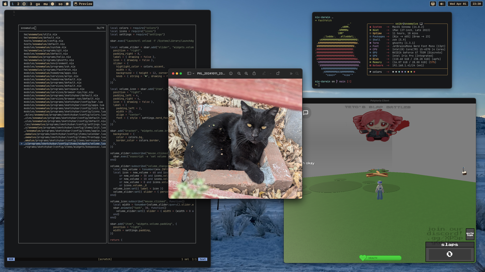

<h1 align=center>
❄️ Soikr's Unixdots! ✨
</h1>

<div align=center>
I hope my configuration finds you well, its intended to be simple even while integrating more complicated configurations like sops and impermanence.
<br><br>
Preview of my MacOS host "snowmalus"
</div>



---

## Structure

```bash
.
├── hm
│   ├── shiverthorn
│   └── snowmalus
├── hosts
│   ├── shiverthorn
│   ├── snowmalus
│   └── winterberry
└── modules
    ├── shiverthorn
    ├── snowmalus
    └── winterberry
```

I always build my systems starting with the **hosts** folder first. This is where I define systems just to get them deployable so I can configure them at a greater level later.

I define the rest of the system in the **modules** folder, such as the environment and programs.

For any user-level configurations, I use the **hm** folder to define Home Manager options.

Additionally, I configure my sops secrets in a private repo.

This configuration is not static and will change. Generally, I try to separate the configurations of each system as much as possible for simplicity, but I do want to have some shared module in the future.

## Installation

This is mostly instructions just for my future self. Instructions remain largely incomplete as of now.

> [!CAUTION]
> Running these will most definitely **NOT** work for you. My configurations are specifically designed to work on my systems.

### Snowmalus (MacOS Desktop)

1. Install [lix](https://lix.systems/)

2. Clone repo to /etc/nix-darwin
   
   ```bash
   nix shell --extra-experimental-features 'nix-command flakes' nixpkgs#git nixpkgs#helix
   git clone git@github.com:Soikr/darwindots.git /etc/nix-darwin
   cd /etc/nix-darwin
   ```

3. Set up nix-darwin and apply configuration
   
   ```bash
   sudo nix run nix-darwin/master#darwin-rebuild -- switch .#snowmalus
   ```

### Shiverthorn (NixOS Laptop)

* Intended to be deployable through [nixos-anywhere](https://nix-community.github.io/nixos-anywhere/)
  
  * Must passthrough disk-encryption-key to /tmp/secret.key
  
  * Define --extra-files to push ssh keys to /persist/etc/ssh/

### Winterberry (NixOS Server)

* Configuration halted for now

## Resources

I am trying to move to citing where I found what in some of my more complicated configurations, this resource list is somewhat outdated now that it encompasses NixOS systems as well.

### MacOS Resources

[nix-darwin Page](https://github.com/LnL7/nix-darwin/tree/master)

[nix-darwin Options](https://daiderd.com/nix-darwin/manual/index.html)

[home-manager Options](https://nix-community.github.io/home-manager/options.xhtml)

[Aerospace Guide](https://nikitabobko.github.io/AeroSpace/guide)

[Sketchybar Guide](https://felixkratz.github.io/SketchyBar)

## Credits

Code formatted with [Alejandra](https://github.com/kamadorueda/alejandra)

Thanks for all the public github repos and software (I couldn't list every resource here) <3
